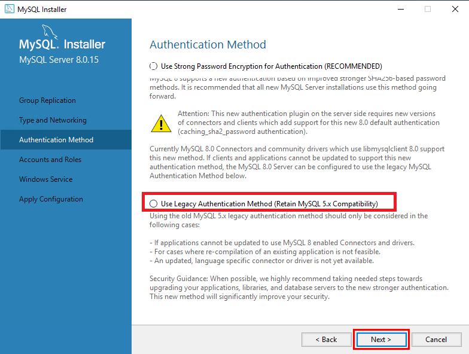

# Web Porject  
  
### install  

    npm i
    
### node run  

    npm run start  

### url (localhost)

    http://localhost:3000/

### create dummy users
    npm run dum

### delete dummy users

    npm run deldum  
    [※주의※ 사용 시 users 테이블 값 전체 삭제]

------------  
## [windows]  
### mysql  
      1. https://dev.mysql.com/downloads/file/?id=512698  
      2. "No thanks, just start my download." <- 클릭  
      3.  아래 사진 제외하고 전부 NEXT  
  
(5.x 버전을 설치해야 node와 연동 가능하다.)  
    
### mysql create table

    CREATE DATABASE myff_db default CHARACTER SET UTF8;

### mysql create user  

    create user 'Locept'@'localhost' identified by 'Locept0705';

### mysql grant user 

    grant all privileges on myff_db.* to 'Locept'@'localhost';

### mysql commit

    FLUSH PRIVILEGES;

## [Dummy Users]
 
>    email : won@myff.com  
    nick  : 집돌이  
    pwd   : 123456789  

>    email : jun@myff.com  
    nick  : 밖돌이  
    pwd   : abcdefg

>    email : son@myff.com  
    nick  : 송송돌이  
    pwd   : qwe789  

>    email : big@myff.com  
    nick  : 먹을거 주세요  
    pwd   :  asd456  

>    email : home@myff.com  
    nick  : 집 전세냄  
    pwd   : zxc123  

  ------------ 
## [스크립트 실행 오류]  
    1. "Windows PowerShell" <- windows 검색  
    2. 관리자 권한 실행  
    3. "get-ExecutionPolicy" <- 입력  
    4. "RemoteSigned" 아닌것을 확인  
    5. "Set-ExecutionPolicy RemoteSigned" <- 입력  

------------  
## [완성 순서]  
    1. 3000포트 서버 열기  
    2. 기본 Controller, Router 설정  
    3. 기본 Mysql DB 연결 완료  
    4. 회원 가입 패스워드 암호화 구현  
    5. 회원 가입 DB 구현  
    6. 로그인 DB 구현  
    7. 기초 JWT 구현  
    8. 더미 유저 생성 구현  
    8. 유저 정보 DB 뼈대 구현 (보기, 수정 ,삭제)  
    9. 게시글 DB 뼈대 구현 (생성, 보기, 수정, 삭제)  
    10. 비동기 사진 글 추출 및 지도 표시 구현 가능  
    11. 메인 화면 지도 위치 표시 가능  

------------  
## [진행 중]  
    1. 지도 API를 위해 React 공부  
    2. locaton DB 구현  
    3. 지도 API (div 화면만 구현) 
    (보류) 좋아요 구현   
